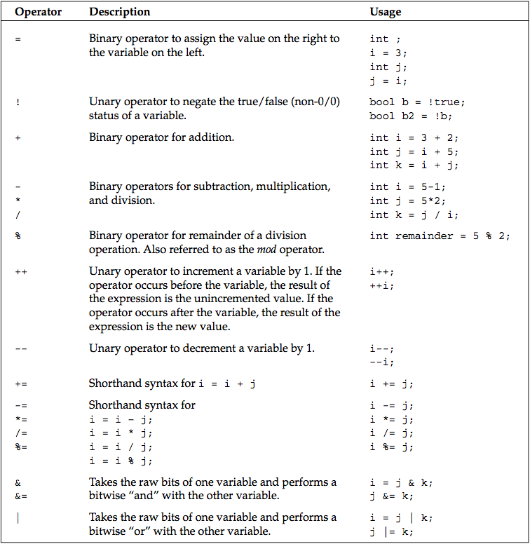
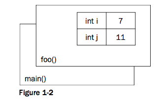

## C++ Research

[CppReference](http://en.cppreference.com/)

#### Preprocessor Directives

Building a C++ program is a three-step process.

* The code is run through a preprocessor
* The code is compiled
* The individual object files are linked together into a single application

#### Run in Mac OSX

* `g++ name.cpp`
* `./a.out`

The iostream header declares the input and output mechanisms provided by C++.

The table below shows some of the most common preprocessor directives.

#### I/O Streams

`std::cout print`
`std::endl  end line`
`\n new line`
`\r carriage return`
`\t tab`
`\\ the backslash character`
`\" quotation mark`

#### Namespaces

Namespaces address the problem of naming conflicts between different pieces of code. For example, you might be writing some code that has a function called foo(). One day, you decide to start using a third- party library, which also has a foo() function. The compiler has no way of knowing which version of foo() you are referring to within your code. You can’t change the library’s function name, and it would be a big pain to change your own.
Namespaces come to the rescue in such scenarios because you can define the context in which names are defined. To place code in a namespace, simply enclose it within a namespace block:

#### Variables

The table that follows shows the most common variable types used in C++.

> C++ does not provide a basic string type. However, a standard implementation of a string is provided as part of the standard library as described later.

Variables can be converted to other types by casting them. For example, an int can be cast to a bool. C++ provides three ways of explicitly changing the type of a variable. The first method is a holdover from C, but is still the most commonly used. The second method seems more natural at first but is rarely seen. The third method is the most verbose, but often considered the cleanest.

* `bool someBool = (bool)someInt; // method 1`
* `bool someBool = bool(someInt); // method 2`
* `bool someBool = static_cast<bool>(someInt); // method 3`

#### Operators

The table below shows the most common operators used in C++ and sample code that makes use of them.

#### Functions

For programs of any significant size, placing all the code inside of main() is unmanageable. To make programs easy to understand, you need to break up, or decompose, code into concise functions.

In C++, you first declare a function to make it available for other code to use. If the function is used inside a particular file of code, you generally declare and define the function in the source file. If the function is for use by other modules or files, you generally put the declaration in a header file and the definition in a source file.

> Function declarations are often called “function prototypes” or “signatures” to emphasize that they represent how the function can be accessed, but not the code behind it.

> In C++, unlike C, a function that takes no parameters just has an empty parameter list. It is not necessary to use “void” to indicate that no parameters are taken. However, you should still use “void” to indicate when no value is returned.

A function declaration is shown below. This example has a return type of void, indicating that the func- tion does not provide a result to the caller. The caller must provide two arguments for the function to work with — an integer and a character.

`void myFunction(int i, char c);`

## Pointers and Dynamic Memory

Dynamic memory allows you to build programs with data that is not of fixed size at compile time. Most nontrivial programs make use of dynamic memory in some form.

### The Stack and the Heap

Memory in your C++ application is divided into two parts — the stack and the heap. One way to visual- ize the stack is as a deck of cards. The current top card represents the current scope of the program, usu- ally the function that is currently being executed. All variables declared inside the current function will take up memory in the top stack frame, the top card of the deck. If the current function, which we’ll call foo() calls another function bar(), a new card is put on the deck so that bar() has its own stack frame to work with. Any parameters passed from foo() to bar() are copied from the foo() stack frame into the bar() stack frame. Figure 1-2 shows what the stack might look like during the execution of a hypothetical function foo() that has declared two integer values.

Stack frames are nice because they provide an isolated memory workspace for each function. If a vari- able is declared inside the foo() stack frame, calling the bar() function won’t change it unless you specifically tell it to. Also, when the foo() function is done running, the stack frame goes away, and all of the variables declared within the function no longer take up memory.

The heap is an area of memory that is completely independent of the current function or stack frame. You can put variables on the heap if you want them to exist even when the function in which they were declared has completed. The heap is less structured than the stack. You can think of it as just a pile of bits. Your program can add new bits to the pile at any time or modify bits that are already in the pile.

### Dynamically Allocated Arrays

To allocate an array dynamically, you first need to declare a pointer:

`int* myVariableSizedArray;`

The * after the int type indicates that the variable you are declaring refers to some integer memory in the heap. Think of the pointer as an arrow that points at the dynamically allocated heap memory. It does not yet point to anything specific because you haven’t assigned it to anything; it is an uninitialized variable.

To initialize the pointer to new heap memory, you use the new command:

`myVariableSizedArray = new int[arraySize];`

