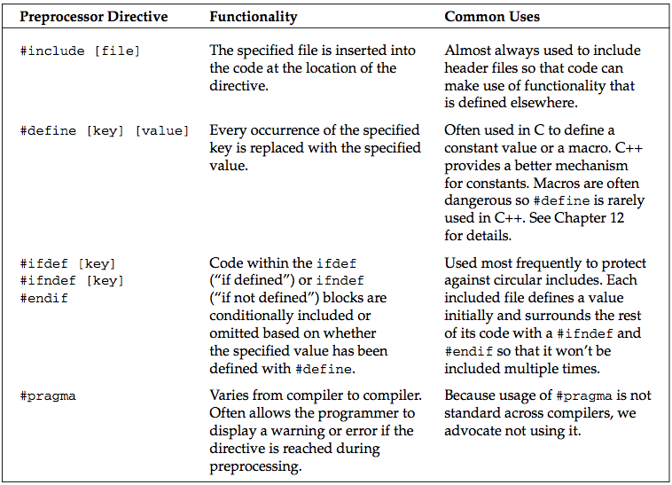
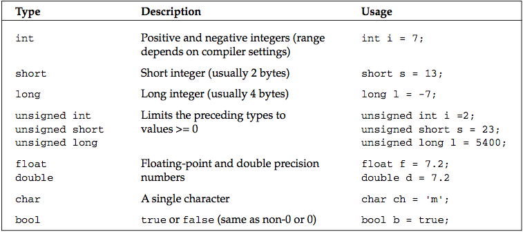

### C++ Research

#### Preprocessor Directives

Building a C++ program is a three-step process.

* The code is run through a preprocessor
* The code is compiled
* The individual object files are linked together into a single application

The iostream header declares the input and output mechanisms provided by C++.

The table below shows some of the most common preprocessor directives.

#### I/O Streams

`std::cout print`
`std::endl  end line`
`\n new line`
`\r carriage return`
`\t tab`
`\\ the backslash character`
`\" quotation mark`

#### Namespaces

Namespaces address the problem of naming conflicts between different pieces of code. For example, you might be writing some code that has a function called foo(). One day, you decide to start using a third- party library, which also has a foo() function. The compiler has no way of knowing which version of foo() you are referring to within your code. You can’t change the library’s function name, and it would be a big pain to change your own.
Namespaces come to the rescue in such scenarios because you can define the context in which names are defined. To place code in a namespace, simply enclose it within a namespace block:

#### Variables

The table that follows shows the most common variable types used in C++.

> C++ does not provide a basic string type. However, a standard implementation of a string is provided as part of the standard library as described later in this chapter and in Chapter 13.

Variables can be converted to other types by casting them. For example, an int can be cast to a bool. C++ provides three ways of explicitly changing the type of a variable. The first method is a holdover from C, but is still the most commonly used. The second method seems more natural at first but is rarely seen. The third method is the most verbose, but often considered the cleanest.

`bool someBool = (bool)someInt; // method 1`
`bool someBool = bool(someInt); // method 2`
`bool someBool = static_cast<bool>(someInt); // method 3`
